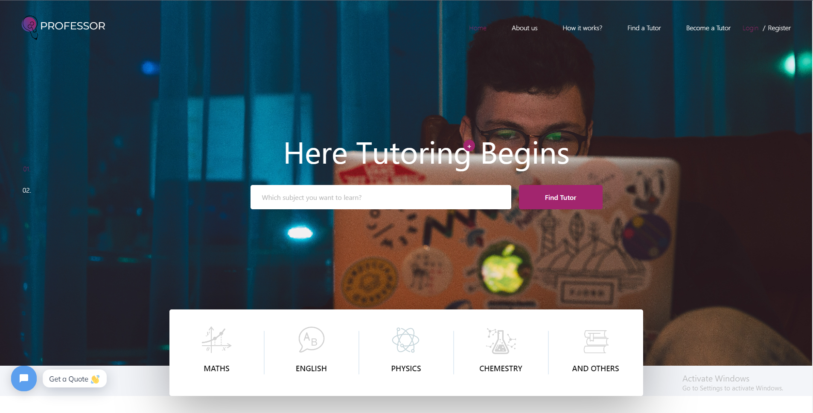
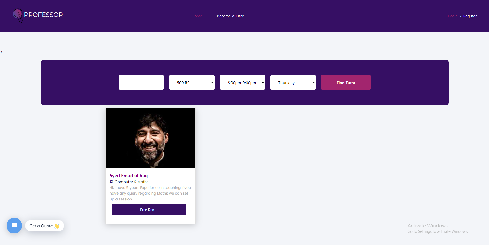
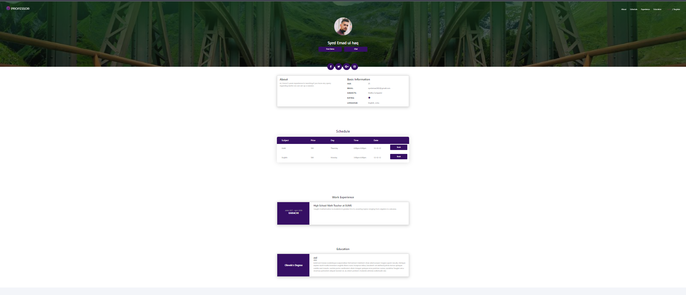
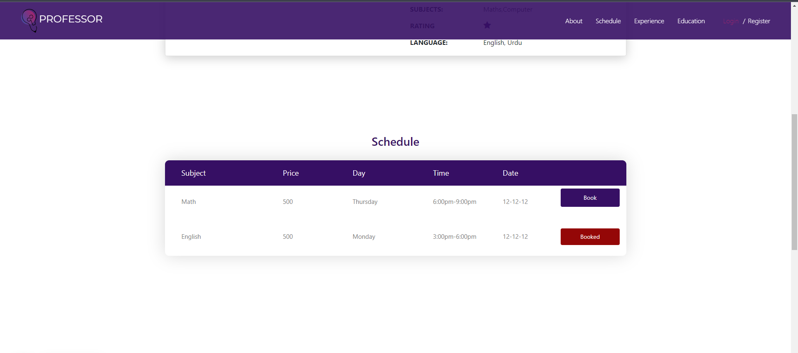
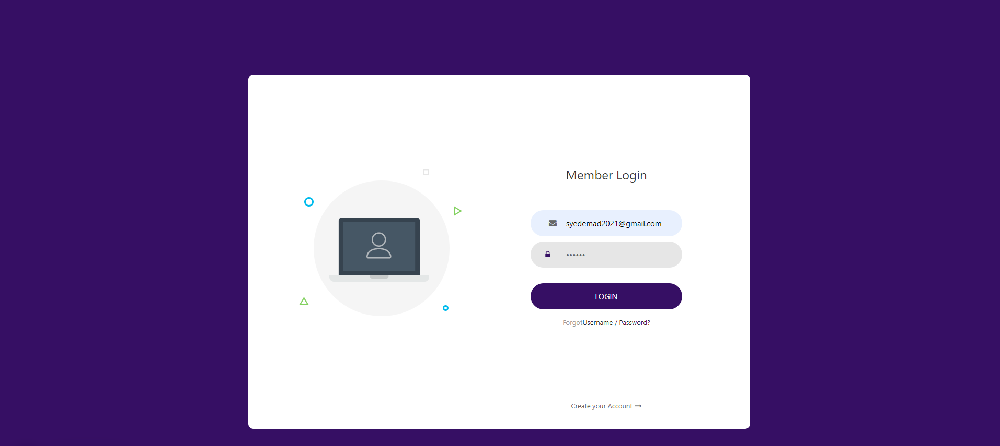
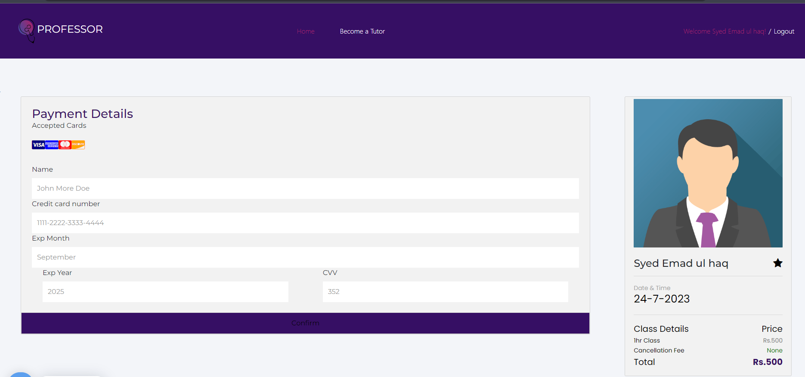
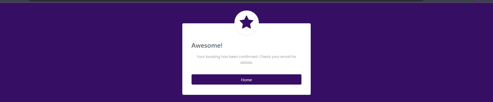
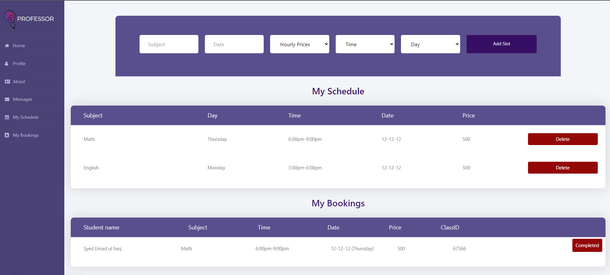
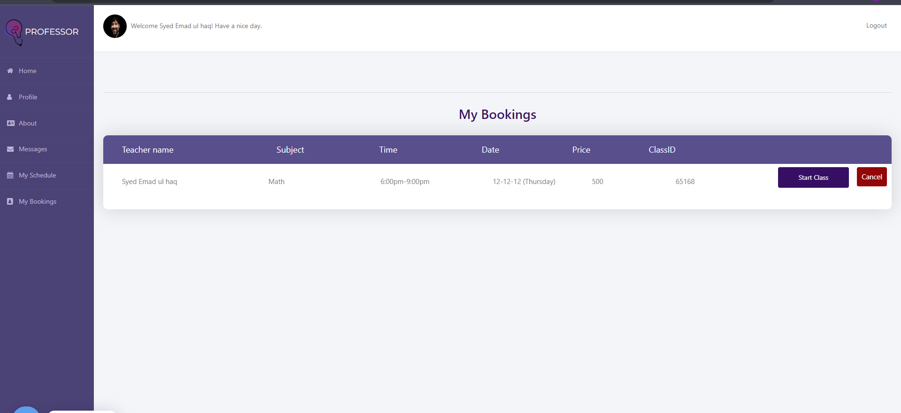

### Description

Professor is an online portal that allows students to find a teacher who best fits their requirements. Students can book sessions with teachers to study. They can pay per session. Both students and teachers have separate dashboards that they can use to keep track of their classes. Online sessions are conducted through video streaming achieved through Agora API.

#### Technologies

Frontend: React.
Styling: Online template.
Backend: Node js.
Database:MoongoDb.

### Overview

## Main Page

## Students can filter teacher that fits there need

## Students can see teacher details and book a slot with them

## Student can only book available slot

## You have to login to book

## Once Logged in you will be redirected to payment page

## User will be shown booking confirmation

## When a student books session it is shown to teacher

## Student can also see the schudule

### Setup

### 1. Clone your repository

Click on the "Code" button and copy the repository's URL.
Open your terminal or command prompt.
Navigate to the directory where you want to clone the repository.
Run the following command, replacing `<repository-url>` with the actual repository URL:
git clone `<repository-url>`

OR

If you have GithubDesktop
Click on code and select Open with Github desktop.
Set up the local path and click on Clone button.

### 2. Install Node Modules

Navigate into the cloned repository directory using cd `<repository-name>`.

Run npm install to install the required dependencies specified in the package.json file:

### 3. Start Application

After the installation is complete, run the following command to launch the React application

1. run nodemon server.js to start to the server
2. goto client directory and run npm start to start client

Open [http://localhost:3000](http://localhost:3000) to view portal in the browser.
